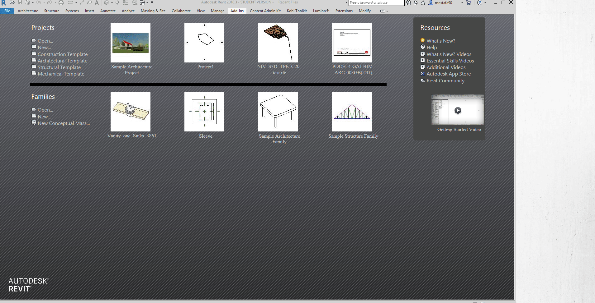

# Revit_WPF_Example
a very minimal example on how to run WPF window on Revit
There was a discussion on Autodesk RevitAPI Community, on how to implement WPF window within Revit. 
[Link](https://forums.autodesk.com/t5/revit-api-forum/revit-crashes-when-exiting-add-in-wpf-application/m-p/9236332/highlight/true#M43707)
I have written this very minimal example on how things works under the hood, and added 2 examples
1. pick object
this will allow user to select an element and show its name on the WPF window

2. Scope to Element
a list of elements are shown in the wpf window. User can click on any of those and Revit will instantly scope to the selected elememt.
(make sure you are in the 3D view)

Hope this helps newbie Revit API users.
